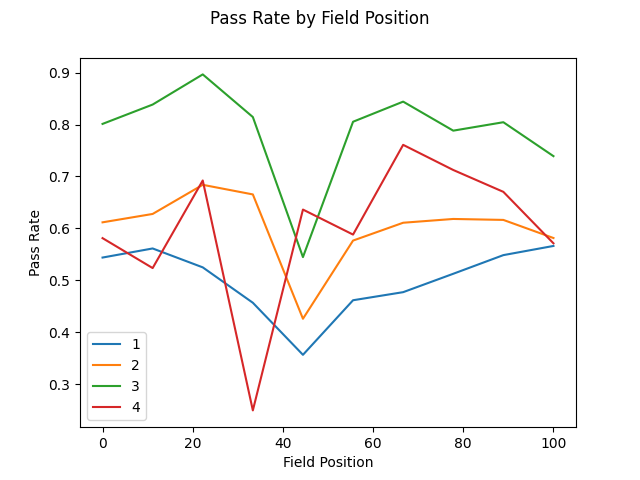
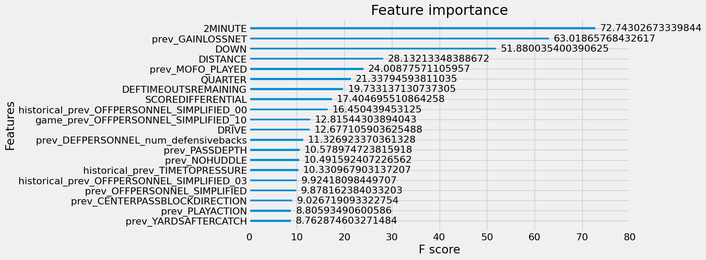

## Exploratory Data Analysis
Notable tendencies:
- Pass 61.2% of the time
- Pass 74.1% of the time during 2Minute drills

## Prior Work
Richard Anderson with Open Source Football estimates the probability of a QB Dropback with an XGBoost model using the features:
- Down (limited to 1,2,3)
- Yards for first down
- Yard line
- Score Differential
- Quarter
- Time remaining in half
- Number of timeouts for the offense and defense
With 100K training examples from 2016-2019, he gets 69.1% accuracy.

## Results

We consider the naive baseline as the simple heuristic of always predicting a pass - one will be correct around 60-62% of the time.

| Model |  Validation Accuracy | Test Accuracy | 
| :---------------- | :------: | ----: |
| Naive Baseline: | 62.64%% | 60.95%%   | 
| Base Model: | 69.73% | 69.52%    | 
| Continuous Features Model: | 69.73% | 69.63%   | 
| Teams Included Model: | 69.88% | 69.04%   | 
| All Features Model: | 70.53% | 70.07   | 

### Feature Importance 

### Tree Structure

### Further Thoughts 

#### Dummy vs One-Hot

In regression important.

What about tree models? Definitely don't have the regression unidentifiable problem, so safer to include all levels.

#### RPO
Only 2.8% of plays had the OPTION feature designated as true. And out of all of those instances, every play was a run. Thus I just left them in and treated them as runs.

### Sources 
1) [Open Source Football](https://opensourcefootball.com/posts/2020-09-07-estimating-runpass-tendencies-with-tidymodels-and-nflfastr/)