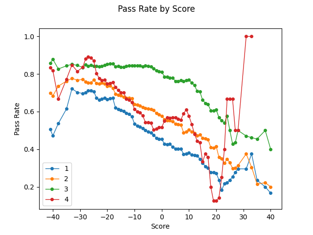
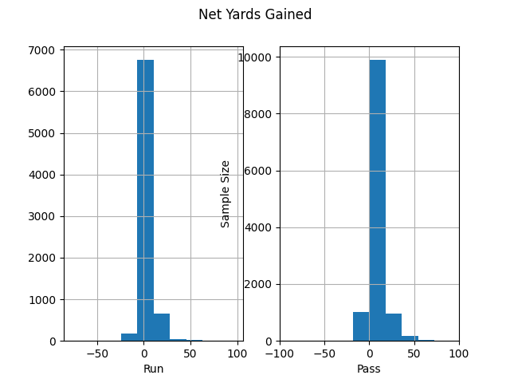
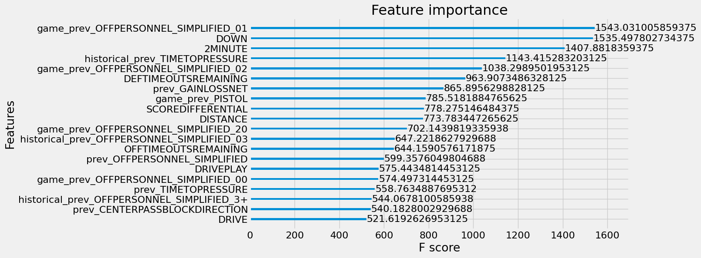

# Goal

Build a predictive model that determines whether the next NFL play will be a run or a pass.

# Exploratory Data Analysis

There are over 19,500 plays across two seasons in the dataset, each with over 90 features describing the run or pass. Teams passed on 61.2% of the plays, but this varies when conditioned on other factors. Teams passed the most on third down and least often on first down.

Teams tend to pass less around the middle of the field (~50 field position). This could be in order to ensure a couple extra additional yards to get into or improve field goal position.

We see more consistent trends when looking at passing rates by score differential - teams with the lead are running the ball more to eat clock, while teams trying to catch up are throwing it more. We also see the same trend with teams running the ball more often in earlier downs.

Unsurprisingly, teams tend to pass more the further away from the first down line they are and tend to run the ball in earlier downs when within 10 yards.

About 10% of the plays in the dataset were 'Two Minute Drill' situations. Teams passed about 74% of the time in these situations.

# Prior Work
Richard Anderson with Open Source Football [estimates](https://opensourcefootball.com/posts/2020-09-07-estimating-runpass-tendencies-with-tidymodels-and-nflfastr/) the probability of a QB Dropback with an XGBoost model using the features:
- Down (limited to 1,2,3)
- Yards for first down
- Yard line
- Score Differential
- Quarter
- Time remaining in half
- Number of timeouts for the offense and defense

With 100K training examples from 2016-2019, he achieves 69.1% accuracy.

[MIT Thesis](https://dspace.mit.edu/bitstream/handle/1721.1/129909/1237411720-MIT.pdf?sequence=1&isAllowed=y)
Neural network is 74.9%, Random Forest is 74.3%

# Feature Engineering

Heuristically we can think of the features as three different sections: game information, team tendencies, and team talent.

## Game Info 

Game Info comprises of the descriptive state of the game at the time of the play, such as like week, quarter, down, distance, etc. Our "base model" only includes these features: 

- 'WEEK',
- 'QUARTER',
- 'SCOREDIFFERENTIAL',
- 'SCORE',
- 'DISTANCE',
- 'DOWN',
- 'FIELDPOSITION',
- 'DRIVE',
- 'DRIVEPLAY',
- 'OFFTIMEOUTSREMAINING',
- 'DEFTIMEOUTSREMAINING',
- 'HASH',
- 'SPOTLEFT',
- '2MINUTE', 
- 'CLOCK'

## Team Tendencies 

Team Tendencies mostly comprises of the additional PFF features in the dataset indicating how teams have played in the past. We have information on each play such as Hurry, Play Action, Pass Depth, Time to Pressure, Middle of the Field Open or Closed (MOFOC), etc. Before the start of each new play, for each of these measures we can record the teams frequency/average in hopes that its predictive of the decision they make in the present. If the middle of the field was open last play, is a team more likely to run the ball? What if it has been open 50% of the time throughout the game? Or if the defense has left it open on average 50% of the time in their previous games?

For each of these stats, I record the previous result, a summary measure over the previous plays in the current game, and a summary measure over all previous plays by the team. For previous plays in the game, I don't start the rolling average until at least 10 plays have happened. For previous plays by the team, I don't start the rolling average until at least 100 plays have happened. These numbers were arbitrarily chosen and could be tuned for optimal choice with appropriate time.

### Personnel Groupings
We simplified the representations of the offensive and defensive personnel groupings, due to sample size and cardinality concerns. There were 40 unique offensive personnel types yet only six were present in more than 1% of the samples. By ignoring receiver-eligibility, additional quarterbacks (+Q), and grouping all three running back sets together, we trimmed this down to 14 distinct categories.

For the 39 distinct defensive sets, I replaced it with three new features recording the number of linemen, linebackers, and defensivebacks.

Apriori I'm uncertain which approach would be best - leaving the feature as categorical (like offensive personnel) or creating new continuous variables. Representing the formation as continuous counts of each position could allow the model to learn to focus on whichever parts of the formation it deems most valuable. For example, if an optimal split was 'are there less than 3 lineman', the model could not do this split easily in the categorical representation. However, if an optimal split was a specific formation such as '4-2-5', the model would need at least four splits under the continuous encoding to representation ('linemen' < 4 (yes) -> 'linemen' < 2 (no) -> 'linebackers' < 3 (yes) -> 'linebackers' < 2 (no) ), compared to the one under the categorical encoding. The decision should be based on how informative one thinks each component of a defensive formation is independent of the others (e.g. how useful of a split could 'number_of_linemen < threshold could be). With further testing one could validate empirically the answer in this context by trying each and seeing which model performs better.

## Team Talent 

Team Talent comprises of how good each team is at running and passing the ball. 

- historical_yards_per_carry
- historical_yards_per_pass_attempt
- historical_yards_allowed_per_carry
- historical_yards_allowed_per_pass_attempt

# Models

I sought a middle ground between simpler baseline models (e.g. linear regression) and powerful yet complex models such as neural networks. Neural networks are generally the most powerful and expressive models available, as evidenced by recent advancements in deep learning and natural language processing. Ideally we would treat our input as a sequence of plays and use a sequential neural architecture, yet they are less interpretable than other methods. Additionally, they can be more complex to train and would have required more data preprocessing to convert the data into sequences.

Therefore the first model to chosen to use is XGBoost, as it has been demonstrated to be one of the best classification algorithms in many tasks. XGBoost also natively handles missing inputs nicely and are more interpretable, with easily computable quantitative feature importance metrics. A decision-tree-based framework might also closely align with how coaches or plays actually make the decision on whether to pass or run.

I ran several models trying different subsets of features. Our baseline is the best naive guess; i.e. what accuracy one would get by predicting the most common class every time (in this case, a pass). The "Base Model" only use the Game Info features we mentioned earlier. The "Continuous Features Model" excludes categorical features from the team tendencies grouping, like Offensvie Personnel and Center Pass Block Direction. The "Teams Included Model" adds as features the label for the offensive and defensive team. The "All Features Model" incorporates all engineered features with basic hyperparameter tuning, while the fully tuned model has more robust hyperparameter tuning.

# Results

We consider the naive baseline as the simple heuristic of always predicting a pass - one will generally be correct around 60-62% of the time.

| Model | Val LogLoss | Val AUC |  Validation Accuracy | Test Accuracy |
| :---------------- | :------: | :------: | :------: | ----: |
| Naive Baseline: | ___ | ___ | 62.64% | 60.95%   | 
| Base Model: | ___ | ___ |69.73% | 69.52%    | 
| Continuous Features Model: | ___ | ___ |69.73% | 69.63%   | 
| Teams Included Model: | ___ | ___ |69.88% | 69.04%   | 
| All Features Model: | ___ | ___ |70.53% | 70.07%   | 
| Fully Tuned All Features Model: | 0.539 | 0.779 |71.33% | 71.81%   | 

## Final Model

Presented are more in-depth classification metrics for our final model. We note that I tuned the model on validation accuracy, as this was my main point of emphasis. It's worth noting that needs of a team may support tuning with respect to a different measure. For example, it is likely that a false negative is worse than a false positive; i.e. a wrong run prediction can hurt a team more than a wrong pass prediction since the yards gained distribution has fatter tails for passes than runs.

Intuitively, this is just saying that a team fully committing to a run can be burned by a deep throw more than a team fully committing to a pass can be burned by a run for a huge gain. So in high-leverage situations one might want to focus on run precision (minimizing the number of false run predictions), which is only better than run recall in the model.

              precision    recall  f1-score   support  
           R       0.64      0.53      0.58       749  
           P       0.74      0.82      0.78      1256  
    accuracy                           0.71      2005  
    macro avg      0.69      0.68      0.68      2005  
    weighted avg   0.71      0.71      0.71      2005  

We can see that the model does a better job overall with passes than runs, with better precision and much better recall.

| Confusion Matrix: |  Pred Run | Pred Pass | 
| :---------------- | :------: | ----: |
| True Run | 394 | 355  | 
| True Pass | 220 | 1036    | 

### Examples

As one example of further investigating the model, I looked at model validation accuracy by down and distance. We see accuracy improve as down and distance increase - where playcalling should get more predictable.

I was curious to see why the model performed so poorly for 1st and 3rd situations. In general teams pass about 35% of the time in this situation (can be seen in the exploratory data analysis), and this was also exhibited in the training data (32% of the time). There were only six validation samples, with four of them passes. The model predicted run for all of them.

It's hasty to draw big conclusions from such a small sample, but one interpretation could be that the model isn't accounting for much outside of the basic game state. Expicitly, once we know the game information like down and distance, the model doesn't have much to draw on for discriminating if a specific example will be a run or pass, so it predicts run for all. One solution may be to better encode team running and passing tendencies. 

The first two examples were from GAMEID=19715 from offensive team Team_10. If we look at all of their previous plays before this moment, we see that they have passed more often on earlier downs (compared to the graph we say in the exploratory data analysis):

 
 While on average teams pass less than 50% of the time when within five yards in first or second down, Team_10 has passed way more frequently in these situations. This could be the reason they opted to pass in the two misclassified validation samples.

## Feature Importance 

### Gain

A feature's gain importance is the improvement in accuracy brought by a feature to the branches its on; i.e. how useful it is to classify the outcomes. Below is a graph of the top features by gain for the base model. The two minute drill feature is by far the largest, followed by down and distance.

While we might expect score differential and time remaining to have a larger importance than otherwise shown, a lot of that is most likely being captured by the two minute drill feature. The most important aspects of score differential and time are when the game is close and time is running out, which is when the two minute drill takes into effect. Down and Distance are not as correlated with other features that can take away some of their contribution to the predictions, like quarter and and drive number.

Below is the plot for the final model's top 20 features by gain. A lot of the variables at the top stay the same, which makes sense as we get a lot of mileage from knowing the down, distance, quarter, score, and timeouts remaining. Previous net yards gain is the new second most important feature, while the number of previous defensivebacks and previous offensive personnel used are among the top ten.

A lof of the important features are descriptions of a previous pass: previous pass depth, dropback depth, time to throw, play action. I wonder how much of this is the value of these features or just simply as a proxy for if the previous play was a pass or not. I think it's mostly the former, but one of the next things I would look at are how passing rates change based on previous pass calls. For example, if you just called a play designed for a long throw, are you more likely to pass again or run? Does it depend on the success of the pass? 

### Coverage

We can also look at the top features by coverage. Instead of telling us which features were important to predicting the class, this tells us the extent of which a feature is used in a model's decision-making process regardless of its predictive power.

Here we see a stark difference - the base features are not nearly as clustered at the top (though still overall important). The offensive team's rate of using '01' personnel during the game is the most important feature, with '02' and '20' personnel rates being high as well. Historical time to pressure is 4th and a team's rate of using pistol formation is 8th.

This trend gives us insight into one facet of how the model is making decisions - it is estimating the offensive team's formation trends () and ability to defend against incoming defensive players (historical time to pressure, previous time to pressure, previous center pass block direction). It's easy to imagine why this is useful, and it shows up empirically in the data:

A team's pass rate goes up as their game rate of '01' personnel usage increases. The inverse holds for '20' personnel - a team is more likely to run the ball if they've used '20' personnel a lot during the game.

## Tree Structure

We can also get an idea about some of the relationships learned by the model from examining the tree structure. Since this is a boosted model consisting of hundreds of trees, we cannot examine all of them, nor will any one tree contribute a majority to the final prediction.

We saw that previous net gain/loss in yards was the second most important feature, and in the first tree it is the root node. The splitting decision is whether or not the previous play gained five yards.

The likely reason this decision was made for the root node is that other important features like down and distance have more complicated interactions between them. For instance, in the exploratory data analysis we saw pass rate by distance significantly differs depending on if its before third down or not. If we solely look at distance without extra features like down, then previous yards gain is a more discriminatory decision: we can draw a clear cut point in the previous gain graph (left) as opposed to the distance graph (right).

If we keep following the tree left, our next split is "Distance < 2" followed by one more split that ends in two leaves with [prediction scores](xgboost.readthedocs.io/en/latest/tutorials/model.html) of -0.083 and -0.055 (while they're not exactly log odds, you can think of them as proportional to probabilities, so the lower the score the lower the probability of a pass).

At a high-level this is telling us that when a team gained less than five yards on their previous play and is less than two yards from a first down, the model is more likely to predict a run than a pass. This aligns with our intuitions that a team is more likely to run when so close to a first down. This is confirmed empirically as teams ran the ball 72.3% of the time when less than two yards from a first down. 

We should note that this tendency is not affected by the previous yards gained by a team. Teams ran the ball 71.7% of the time when less than two yards and gaining less than five yards in their previous plays - effectively no difference. Instead this is more indicative of the general trend in this tree to use 'Distance < 2' as a powerful split early in branches, regardless of the preceding node. The reason for this is evident in the exploratory data analysis, where we inspected pass rates based on down and distance. While pass rates significantly diverged as a function of distance conditioned on downs, all pass rates were low for distances less than two, regardless of down.

Speaking of this relationship...this is exactly what this side of the tree captures. If distance is greater or equal to two, the next split is if its before third down or not.

We can see that the leaves on the no side of the 'DOWN: {1,2}' split have positive scores - indicating a higher probability of a pass. The leaf on the yes side of the 'DOWN: {1,2}' split have negative scores, i.e. more likely to run, which is what we saw in the above graph.

# Future

To do:
Historical Pass/Run tendencies
Previous outcome (Pass, Run, Sack)

## Further Thoughts 

### Dummy vs One-Hot

In regression important.

What about tree models? Definitely don't have the regression unidentifiable problem, so safer to include all levels.

### RPO
Only 2.8% of plays had the OPTION feature designated as true. And out of all of those instances, every play was a run. Thus I just left them in and treated them as runs.

### Gain vs Coverage
Variable selection vs interpretability.
(Mention here?)
But also continuous variables not as important in coverage

### Leaf: game_prev_PENALTY < 0.0571
Addressing this node in the tree structure section would have interrupted the more pertinent discussion around the features with the highest importance, but I did want to bring this up. (EXPLAIN WHY LESS SIGNIFICANT)

If there is a penalty called, it is three times as likely for the play to have been a pass than a run in our dataset. Thus I think the model may be trying to pick up that, if the team has been committing a lot of penalties in the game, then they may be throwing the ball more often than average. Thus if the offensive team's penalty rate during the game is above the threshold, the score is more positive than if it were below the threshold.

But again, this is on the margin (REWORD).
